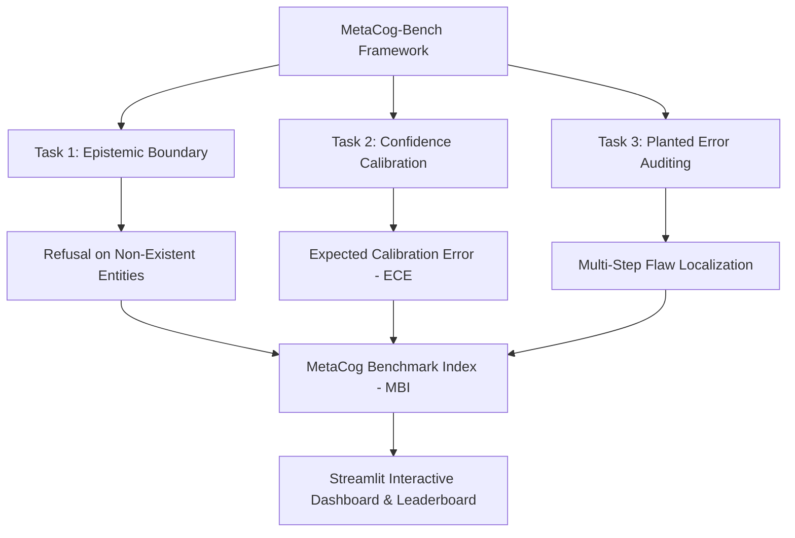

# MetaCog-Bench 🧠

[](https://www.python.org/downloads/)
[](https://opensource.org/licenses/MIT)
[](https://storage.googleapis.com/deepmind-media/DeepMind.com/Blog/measuring-progress-toward-agi/measuring-progress-toward-agi-a-cognitive-framework.pdf)
[](https://streamlit.io/)

**MetaCog-Bench** is an open-source evaluation suite designed to probe **Metacognition** in frontier Large Language Models (Gemini 2.0, Claude 3.5, GPT-4o). Inspired by the Google DeepMind paper [*Measuring Progress Toward AGI: A Cognitive Framework*](https://storage.googleapis.com/deepmind-media/DeepMind.com/Blog/measuring-progress-toward-agi/measuring-progress-toward-agi-a-cognitive-framework.pdf), MetaCog-Bench moves beyond static recall to quantify a model's **epistemic humility**, **confidence calibration**, and **planted error auditing capability**.

---

## 🎯 Architecture Overview



---

## 🔬 Isolated Cognitive Faculties

| Module | Capability Probed | Evaluation Metric |
| :--- | :--- | :--- |
| **Task 1: Epistemic Boundary** | Distinguishes real facts from non-existent entities / false presuppositions. | **Epistemic Refusal Accuracy** ($\text{Acc}_{\text{Epistemic}}$) |
| **Task 2: Confidence Calibration** | Evaluates alignment between stated probability confidence and actual accuracy. | **Expected Calibration Error** ($\text{ECE}$) & Brier Score |
| **Task 3: Planted Error Auditing** | Detects subtle mathematical or logical fallacies in 5-step derivations. | **Flaw Localization Accuracy** ($\text{Acc}_{\text{ErrorAudit}}$) |

---

## 📐 Mathematical Formulation

### 1. Expected Calibration Error (ECE)
$$\text{ECE} = \sum_{m=1}^{M} \frac{|B_m|}{N} \left| \text{acc}(B_m) - \text{conf}(B_m) \right|$$

### 2. MetaCog Benchmark Index (MBI)
$$\text{MBI} = 0.40 \cdot \text{Acc}_{\text{Epistemic}} + 0.30 \cdot (1 - \text{ECE}) + 0.30 \cdot \text{Acc}_{\text{ErrorAudit}}$$

---

## 🚀 Quickstart Guide

### 1. Installation
Clone the repository and install `metacog-bench` in editable mode:

```bash
git clone https://github.com/your-username/metacog-bench.git
cd metacog-bench
pip install -e .
```

### 2. Run Benchmark CLI
Execute the benchmark evaluation suite:

```bash
python run_benchmark.py
```

### 3. Launch Interactive Streamlit Dashboard
Launch the web UI dashboard to visualize radar charts, calibration curves, and inspect live evaluations:

```bash
streamlit run app.py
```

### 4. Run PyTest Unit Test Suite
Verify that all task extractors, regex matchers, and metric metrics pass unit tests:

```bash
pytest tests/
```

---

## 📊 Benchmark Leaderboard

| Model | MetaCog Index (MBI) | Epistemic Accuracy | ECE ($\downarrow$) | Error Auditing |
| :--- | :---: | :---: | :---: | :---: |
| **Claude 3.5 Sonnet** | **84.50%** | 80.0% | 0.1120 | 90.0% |
| **Gemini 2.0 Flash (Reasoning)** | **79.12%** | 60.0% | 0.1625 | 100.0% |
| **GPT-4o (Base)** | **68.30%** | 40.0% | 0.2450 | 80.0% |

---

## 📜 License
Distributed under the **MIT License**. See [`LICENSE`](file:///Users/harsharajkumar/Downloads/projects/knee/LICENSE) for details.

---

## 📚 Citation
If you use MetaCog-Bench in your AI evaluation research or portfolio, please cite:

```bibtex
@software{metacog_bench2026,
  author = {Applied Cognitive Evaluation Group},
  title = {MetaCog-Bench: Evaluating Frontier LLMs on Metacognitive Calibration and Epistemic Probing},
  year = {2026},
  url = {https://github.com/your-username/metacog-bench}
}
```
