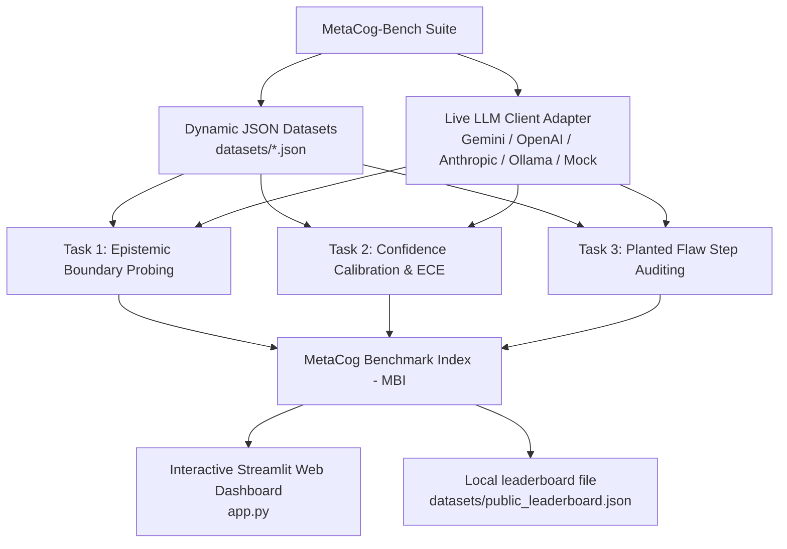

# MetaCog-Bench 🧠

[](https://www.python.org/downloads/)
[](https://opensource.org/licenses/MIT)
[](https://storage.googleapis.com/deepmind-media/DeepMind.com/Blog/measuring-progress-toward-agi/measuring-progress-toward-agi-a-cognitive-framework.pdf)
[](https://streamlit.io/)
[](https://github.com/psf/black)

**MetaCog-Bench** is an open-source AI evaluation framework designed to probe **Metacognition** in frontier Large Language Models (Gemini 2.0, Claude 3.5, GPT-4o). Inspired by Google DeepMind's research paper [*Measuring Progress Toward AGI: A Cognitive Framework*](https://storage.googleapis.com/deepmind-media/DeepMind.com/Blog/measuring-progress-toward-agi/measuring-progress-toward-agi-a-cognitive-framework.pdf), MetaCog-Bench moves beyond static recall to quantify a model's **epistemic humility**, **confidence calibration**, and **planted flaw auditing capability**.

---

## 💡 Executive Summary & Problem Statement

Current frontier AI models excel on traditional static benchmarks (e.g. MMLU, GSM8K, MATH) by exploiting crystallized pre-training knowledge. However, these evaluations fail to measure a model's **metacognitive monitoring and self-regulation**—its internal ability to evaluate its own logical certainty and knowledge boundaries.

In deployment, models exhibit three critical metacognitive failure modes:

1. **Uncalibrated Overconfidence**: Models state ~99% confidence on subtle hallucinations or flawed multi-step derivations.
2. **Epistemic Horizon Blindness**: Models fail to distinguish between verifiable facts and non-existent, fictional, or unanswerable entities (hallucinating details for false-presupposition queries instead of expressing appropriate ignorance).
3. **Flaw-Echoing & Confabulation**: When presented with a multi-step logical chain containing a single planted mathematical error, models often endorse or defend the flawed steps rather than isolating the fallacy.

**MetaCog-Bench** isolates these failure modes through an automated evaluation harness, dynamic JSON datasets, live API integrations (Google Gemini, OpenAI, Anthropic, Ollama), and an interactive dual-session web dashboard.

---

## 🏗️ System Architecture



---

## 🔬 Probed Cognitive Faculties & Metrics

MetaCog-Bench evaluates models across three targeted task modules:

| Task Module | Probed Capability | Target Objective | Evaluation Metric |
| :--- | :--- | :--- | :--- |
| **Task 1: Epistemic Boundary** | **Epistemic Horizon Humility** | Refuses false-presupposition queries & non-existent entities (fictional treaties, non-existent constants). | **Epistemic Refusal Accuracy** ($\text{Acc}_{\text{Epistemic}}$) |
| **Task 2: Confidence Calibration** | **Metacognitive Monitoring** | Measures alignment between stated probability confidence ($0.0-1.0$) and actual correctness on trick logic problems. | **Expected Calibration Error** ($\text{ECE}$) & Brier Loss |
| **Task 3: Planted Error Auditing** | **Logical Self-Correction** | Identifies the exact step number containing a planted flaw (e.g. division by zero, sign flip) in 5-step derivations. | **Flaw Localization Accuracy** ($\text{Acc}_{\text{ErrorAudit}}$) |

---

## 📐 Mathematical Formulation

### 1. Expected Calibration Error (ECE)
Samples are partitioned into $M$ equally-spaced confidence bins $B_1, B_2, \dots, B_M$. ECE measures the weighted absolute difference between bin accuracy and bin confidence:

$$\text{ECE} = \sum_{m=1}^{M} \frac{|B_m|}{N} \left| \text{acc}(B_m) - \text{conf}(B_m) \right|$$

### 2. Brier Score
$$\text{Brier} = \frac{1}{N} \sum_{i=1}^{N} (f_i - o_i)^2$$
where $f_i \in [0, 1]$ is the model's stated confidence and $o_i \in \{0, 1\}$ is the binary accuracy outcome.

### 3. MetaCog Benchmark Index (MBI)
The aggregate composite benchmark score normalized to a scale of $0.0 - 100.0$:

$$\text{MBI} = \left( 0.40 \cdot \text{Acc}_{\text{Epistemic}} + 0.30 \cdot (1.0 - \text{ECE}) + 0.30 \cdot \text{Acc}_{\text{ErrorAudit}} \right) \times 100.0$$

---

## 🌟 Key Features

- **🔌 Universal Multi-Provider API Adapter**:
  - Direct integration with **Google Gemini API** (`gemini-2.0-flash`, `gemini-1.5-pro`).
  - Direct integration with **OpenAI API** (`gpt-4o`, `gpt-4-turbo`).
  - Direct integration with **Anthropic API** (`claude-3-5-sonnet`).
  - Direct integration with **Ollama Local LLMs** (`llama3`, `mistral`, `phi3`).
  - **Offline Mock Engine** for testing without API keys.

- **🔐 Dual-Session Evaluation Architecture**:
  - 🔒 **Private Sandbox Session**: Runs evaluations locally in your browser session without exposing scores or prompt responses.
  - 🌐 **Public Leaderboard Submission**: Appends evaluation scores to a local leaderboard file (`datasets/public_leaderboard.json`) that drives the dashboard's rankings, radar charts, and ECE curves.

- **📊 Interactive Streamlit Web Dashboard (`app.py`)**:
  - Live model rank leaderboard table.
  - Interactive Plotly multi-axis radar charts comparing metacognitive capabilities.
  - ECE reliability curves (Confidence vs. Actual Accuracy).
  - Real-time prompt evaluator sandbox & model inspector.

- **🧪 Automated PyTest Test Suite (`tests/test_benchmark.py`)**:
  - Unit tests for the dataset loaders, regex extractors, ECE math, and evaluator harness (coverage not measured).

---

## 🚀 Quickstart Guide

### 1. Installation
Clone the repository and install `metacog-bench` in editable mode:

```bash
git clone https://github.com/harsharajkumar-273/metacog-bench.git
cd metacog-bench
pip install -e .
```

### 2. Run CLI Evaluation Runner
Run live model evaluations directly from the command line:

```bash
# Run with Mock Engine (Offline)
python run_benchmark.py --provider mock

# Run with Google Gemini API
python run_benchmark.py --provider gemini --api-key YOUR_GEMINI_KEY --model-name gemini-2.0-flash

# Run with OpenAI API
python run_benchmark.py --provider openai --api-key YOUR_OPENAI_KEY --model-name gpt-4o
```

### 3. Launch Interactive Streamlit Dashboard
Launch the web dashboard to visualize radar charts, ECE reliability diagrams, and submit public leaderboard runs:

```bash
streamlit run app.py
```
Open **`http://localhost:8501`** in your browser.

### 4. Run PyTest Unit Test Suite
Verify that all task extractors, regex matchers, dataset loaders, and metric formulas pass unit tests:

```bash
pytest tests/ -vv
```

---

## 🏆 Results status

**No verified results yet.** The entries in `datasets/public_leaderboard.json` aren't backed by saved model outputs, and the bundled datasets are still tiny (5 epistemic-boundary items, 4 calibration items, 2 error-auditing items), too few to produce a score like 90% on error auditing. Treat those entries as sample data.

Next steps before publishing any numbers:

1. Grow each task to at least 100 items.
2. Run each model with a fixed prompt, temperature, and seed, and save the raw responses.
3. Report every metric with a bootstrap confidence interval.

---

## 📂 Repository Directory Structure

```text
metacog-bench/
├── metacog_bench/                 # Package Source Directory
│   ├── __init__.py
│   ├── config.py                  # Benchmark Constants & Composite Metric Weights
│   ├── llm_client.py              # Multi-Provider LLM API Adapter (Gemini, OpenAI, Anthropic, Ollama)
│   ├── evaluator.py               # Dynamic Evaluation Harness
│   ├── leaderboard.py             # Persistent Leaderboard Manager
│   └── tasks/                     # Task Modules
│       ├── __init__.py
│       ├── epistemic_boundary.py  # Task 1 Module
│       ├── confidence_calibration.py # Task 2 Module
│       └── error_auditing.py      # Task 3 Module
├── datasets/                      # Dynamic JSON Dataset Files
│   ├── epistemic_boundary.json
│   ├── confidence_calibration.json
│   ├── error_auditing.json
│   └── public_leaderboard.json    # Local leaderboard file (sample entries)
├── tests/                         # PyTest Unit Test Suite
│   ├── __init__.py
│   └── test_benchmark.py
├── app.py                         # Streamlit Dual-Session Web Dashboard
├── run_benchmark.py               # CLI Evaluation Runner
├── setup.py                       # Setuptools Package Configuration
├── pyproject.toml                 # PEP 517/518 Build Specification
├── writeup.md                     # Hackathon write-up
├── README.md                      # GitHub Documentation
├── LICENSE                        # MIT Open Source License
└── .gitignore                     # Git Exclusion Rules
```

---

## 🤝 Contributing & Adding Custom Datasets

We welcome community contributions! You can easily extend MetaCog-Bench by adding custom evaluation prompts directly to `datasets/*.json`:

1. Add your JSON prompt object to `datasets/epistemic_boundary.json`:
   ```json
   {
     "id": "epistemic_custom_01",
     "type": "non_existent",
     "prompt": "Your false-presupposition query here...",
     "ground_truth_category": "UNKNOWN"
   }
   ```
2. Run `pytest tests/` to verify dataset integrity.
3. Submit a Pull Request!

---

## 📜 License
Distributed under the **MIT License**. See [`LICENSE`](LICENSE) for details.

---

## 📚 Citation & Acknowledgments
If you use **MetaCog-Bench** in your AI evaluation research or portfolio, please cite:

```bibtex
@software{metacog_bench2026,
  author = {Raj Kumar, Harsha},
  title = {MetaCog-Bench: Evaluating Frontier LLMs on Metacognitive Calibration, Epistemic Horizon Humility, and Planted Flaw Auditing},
  year = {2026},
  publisher = {GitHub},
  journal = {GitHub repository},
  url = {https://github.com/harsharajkumar-273/metacog-bench}
}
```

*Acknowledging Google DeepMind and Kaggle for hosting the Measuring Progress Toward AGI competition framework.*
